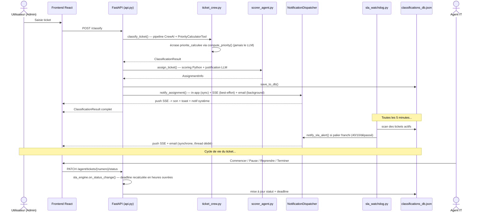

# DESCRIPTION TECHNIQUE — PROJET DE FIN D'ÉTUDES
## Système de Classification et de Dispatch Intelligent de Tickets IT — LVMH Power BI

> **Note méthodologique :** Ce document décrit **ce qui existe réellement dans le code source**, avec
> l'intention explicite de servir de matière première pour la rédaction du rapport de PFE : chaque
> section technique explique non seulement CE QUI a été construit, mais POURQUOI ce choix a été fait,
> quelles alternatives ont été écartées, et quelles difficultés ont été rencontrées puis résolues.
> Les éléments absents, incomplets ou différés sont signalés explicitement en section **10** et **12**
> plutôt que passés sous silence.

---

## TABLE DES MATIÈRES

1. [Contexte et problématique](#1-contexte-et-problématique)
2. [Architecture globale — agents LLM vs modules déterministes](#2-architecture-globale--agents-llm-vs-modules-déterministes)
3. [Arborescence du projet](#3-arborescence-du-projet)
4. [Formule de scoring et de classification](#4-formule-de-scoring-et-de-classification)
5. [Module de notification (Phase 1)](#5-module-de-notification-phase-1)
6. [Module SLA (Lots 1-3)](#6-module-sla-lots-1-3)
7. [Qualité et fiabilité — le processus des deux audits](#7-qualité-et-fiabilité--le-processus-des-deux-audits)
8. [Choix d'architecture assumés](#8-choix-darchitecture-assumés)
9. [Dashboard et interface temps réel](#9-dashboard-et-interface-temps-réel)
10. [Stack technique](#10-stack-technique)
11. [Flux de données end-to-end](#11-flux-de-données-end-to-end)
12. [Limites connues et perspectives](#12-limites-connues-et-perspectives)
13. [Zones à clarifier](#13-zones-à-clarifier)
14. [Intégration ServiceNow — webhooks bidirectionnels](#14-intégration-servicenow--webhooks-bidirectionnels)
15. [Accessibilité et internationalisation (frontend)](#15-accessibilité-et-internationalisation-frontend)

---

## 1. CONTEXTE ET PROBLÉMATIQUE

### 1.1 Contexte

L'équipe support IT de LVMH, groupe "WW - POWERBI - L2", traite quotidiennement des incidents et des
demandes liés à Power BI et aux outils de données des maisons du groupe (Dior, Guerlain, LVMH Beauty
Tech, etc.). Ces tickets, saisis en langage naturel, doivent être manuellement catégorisés selon la
taxonomie ITIL, priorisés selon une matrice impact/urgence, puis assignés à l'un des six membres de
l'équipe en fonction de leurs compétences, de leur charge de travail et de leur affinité avec les
marques concernées.

Ce processus manuel est chronophage, source d'incohérences dans la classification et de
sous-optimalité dans l'assignation. Une fois le ticket assigné, deux problèmes supplémentaires
apparaissent en pratique : l'agent concerné n'est pas prévenu tant qu'il ne consulte pas activement la
plateforme, et rien ne garantit que les délais de traitement contractuels (SLA) associés à la priorité
du ticket soient respectés ni même surveillés.

### 1.2 Objectif du projet

Le projet implémente un **système automatisé de classification, de dispatch, de notification et de
surveillance SLA** pour les tickets IT, qui :

1. **Classifie automatiquement** chaque ticket entrant selon la taxonomie ITIL LVMH (catégorie,
   sous-catégorie, service, impact, urgence, priorité) via un pipeline de trois agents LLM orchestrés
   par CrewAI.
2. **Assigne automatiquement** le ticket au membre le plus approprié en combinant un scoring
   déterministe Python (compétences, charge, affinité marque, performance historique) avec un LLM
   pour la génération de la justification en français.
3. **Notifie en temps réel** l'agent assigné (email + notification in-app + push SSE + son/toast/
   notification système côté navigateur) sans attendre qu'il rafraîchisse manuellement la page.
4. **Surveille les SLA** par priorité de ticket en calculant les délais sur les heures ouvrées
   (lundi–vendredi, 07h00–19h00), en alertant à des paliers successifs (40 % consommé, 10 % restant,
   dépassé) et en escaladant vers les managers si nécessaire.
5. **Gère les profils des membres** de l'équipe : l'identité et les compétences sont dérivées de
   10 000 tickets historiques au bootstrap, tandis que les métriques de performance (délai moyen,
   taux de respect SLA, etc.) sont désormais alimentées exclusivement par les résolutions réelles
   de tickets dans l'application, et préservées d'un re-bootstrap à l'autre (voir §4.3).
6. **Expose une API REST** (FastAPI, authentifiée par JWT) consommée par une interface React (Kanban,
   suivi SLA, profils équipe, espace agent).

### 1.3 Périmètre

- **Backend :** `Ticket-Classifier--main - Copie` (Python, FastAPI, CrewAI)
- **Frontend :** `frontend` (React 19, Vite), au même niveau que le backend
- **LLM :** GPT-4o via la gateway Azure API Management d'EY
- **Équipe cible :** 6 membres du groupe "WW - POWERBI - L2"
- **Source de données :** `incident-10000.xlsx` (10 000 tickets historiques LVMH)

---

## 2. ARCHITECTURE GLOBALE — AGENTS LLM VS MODULES DÉTERMINISTES

### 2.1 Principe de conception central

Le choix d'architecture le plus structurant du projet — et le plus réutilisable comme argument de
conception dans un rapport — est la séparation stricte entre **ce qui doit passer par un LLM** et **ce
qui ne doit jamais y passer** :

> **Un LLM est utilisé uniquement là où la tâche relève du jugement ou de la génération de texte libre
> (interpréter une description en langage naturel, rédiger une phrase de justification en français).
> Toute valeur qui a une formule déterministe (une priorité issue d'une matrice, un score de dispatch,
> une deadline SLA) est calculée en Python pur, jamais par le LLM — même quand le LLM aurait
> techniquement pu la produire.**

Cette règle n'est pas seulement une préférence de conception : elle a été durcie **a posteriori**, après
qu'un audit a montré que la confier au LLM pour `priorite_calculee` avait rendu, silencieusement, la
totalité du système d'alerte SLA inopérant (voir section 7.2). Elle est donc devenue un principe
explicite du projet plutôt qu'une intuition de départ.

### 2.2 Composants réels

| Composant | Nature | Fichier(s) |
|-----------|--------|------------|
| Agent 1 : Analyst | LLM (CrewAI) | `src/agents/ticket_crew.py` |
| Agent 2 : Classifier | LLM (CrewAI) + outil déterministe | `src/agents/ticket_crew.py` |
| Agent 3 : Auditor | LLM (CrewAI) + output Pydantic | `src/agents/ticket_crew.py` |
| Agent 4 : Scorer | Scoring Python déterministe + LLM (justification texte uniquement) | `src/agents/scorer_agent.py` |
| Moteur Profiling | Python pur, aucun LLM | `src/agents/profiling_agent.py`, `src/agents/profiles_store.py` |
| Module Notification | Python pur, aucun LLM | `src/notifications/` (`dispatcher.py`, `email_sender.py`, `sse_manager.py`, `store.py`) |
| Module SLA | Python pur, aucun LLM | `src/sla/` (`sla_engine.py`, `sla_watchdog.py`) |
| Module ServiceNow | Python pur, aucun LLM | `src/servicenow.py` (voir section 14) |
| Module Authentification | Python pur, aucun LLM | `src/auth.py` (JWT legacy + validation JWKS Keycloak), `src/keycloak_admin.py` (voir section 8.4) |

Sur 9 composants métier, **3 seulement font appel à un LLM**, et dans deux cas (Classifier, Scorer) le
LLM est encadré par un outil ou un calcul Python qui a le dernier mot sur la valeur numérique produite.
Notification, SLA, ServiceNow et Authentification — les modules les plus récents du projet — sont
**entièrement déterministes** : un choix assumé, détaillé section 8.

### 2.3 Justification du choix (argument de conception pour le rapport)

- **LLM = jugement et texte libre.** Comprendre qu'un « écran figé » et un « rapport qui ne charge
  pas » relèvent tous deux d'un problème applicatif, extraire l'intention d'une description en
  français rédigée par un utilisateur non technique, rédiger une phrase de justification naturelle :
  ce sont des tâches où un LLM apporte une valeur qu'un système à règles ne peut pas égaler.
- **Code déterministe = fiabilité et reproductibilité.** Une matrice impact × urgence → priorité, une
  deadline SLA calculée sur des heures ouvrées, un score de dispatch pondéré : ce sont des fonctions
  pures. Les confier à un LLM introduit une variabilité (le LLM peut produire un format légèrement
  différent d'un appel à l'autre) là où l'utilisateur — et le système d'alerte SLA en aval — a besoin
  d'une valeur strictement stable et auditable.
- **Alternative écartée :** laisser le LLM calculer directement `priorite_calculee` à partir de sa
  propre lecture d'`impact`/`urgence` (ce qui était le comportement initial du projet). Écartée car
  elle a produit exactement le bug bloquant décrit en section 7.2.

---

## 3. ARBORESCENCE DU PROJET

### 3.1 Backend

```
Ticket-Classifier--main/
│
├── .env.example                  # Template des variables d'environnement (EY Azure, SMTP, JWT)
├── requirements.txt              # Dépendances Python
├── run_backend.py                # Point d'entrée : lance Uvicorn sur le port 8000
├── evaluate_agents.py            # Script de benchmark : mesure l'accuracy du pipeline
│                                  # (AUDIT_REPORT.md, le rapport des deux audits qualité/sécurité
│                                  #  décrit en section 7, n'est pas présent dans cette copie du
│                                  #  dépôt — voir note en tête de section 7)
│
├── scripts/
│   ├── migrate_priorite_calculee.py    # Migration one-shot des données historiques (voir 7.2)
│   └── migrate_users_to_keycloak.py    # Migration one-shot users.json → Keycloak (dry-run par défaut, voir 8.4)
│
├── src/
│   ├── api.py                    # CŒUR : tous les endpoints FastAPI + orchestration métier
│   ├── auth.py                   # AUTH_MODE=legacy (JWT HS256 + bcrypt) OU keycloak (JWKS RS256) — voir 8.4
│   ├── keycloak_admin.py         # Client REST Admin Keycloak (users, rôles, email reset) — mode keycloak uniquement
│   ├── servicenow.py             # Client REST ServiceNow (lecture/écriture incidents — voir section 14)
│   │
│   ├── agents/
│   │   ├── ticket_crew.py        # Module 1 : pipeline CrewAI (3 agents + PriorityCalculatorTool)
│   │   ├── scorer_agent.py       # Module 2 : dispatch hybride (Python scoring + LLM justification)
│   │   ├── profiling_agent.py    # Profilage pur Python : bootstrap, update, normalisation charge
│   │   ├── profiles_store.py     # Persistance verrouillée + atomique des profils/disponibilités
│   │   └── set_availability.py   # CLI + fonction importable : gestion des disponibilités
│   │
│   ├── notifications/            # Module de notification (Phase 1 — voir section 5)
│   │   ├── dispatcher.py         # Façade NotificationDispatcher : orchestration in-app + email + SSE
│   │   ├── email_sender.py       # EmailNotifier : envoi SMTP Gmail (assignation + alertes SLA)
│   │   ├── sse_manager.py        # Gestionnaire de connexions Server-Sent Events en mémoire
│   │   └── store.py              # Persistance des notifications in-app (notifications.json)
│   │
│   ├── sla/                      # Module SLA (Lots 1-3 — voir section 6)
│   │   ├── sla_engine.py         # Calcul pur : heures ouvrées, deadlines, transitions de statut
│   │   └── sla_watchdog.py       # Job périodique APScheduler : alertes à paliers + escalade
│   │
│   └── preprocessing/
│       └── prepare_data.py       # One-time : Excel → few_shot_examples.json + eval_dataset.json
│
├── tests/
│   ├── test_api.py                       # Tests d'intégration HTTP (voir limite en 12.6 — toujours cassé, pas de token)
│   ├── test_auth.py                      # Tests unitaires JWKS/RS256 mode keycloak (paire de clés RSA générée localement)
│   ├── test_email.py                     # Test manuel d'envoi SMTP (identifiants réels requis)
│   ├── test_sla_engine.py                # Tests unitaires du moteur SLA (dates fixes, sans I/O)
│   ├── test_sla_watchdog.py              # Tests unitaires du job d'alerte à paliers
│   ├── test_sla_watchdog_integration.py  # Test manuel bout-en-bout (backend + SMTP réels)
│   ├── test_profiles_store.py            # Test de concurrence (20 threads, écritures atomiques)
│   └── test_auth_users_store.py          # Test de concurrence (20 threads) sur users.json — voir 7.3
│
├── data/
│   ├── raw/
│   │   └── incident-10000.xlsx   # Dataset source — ne pas modifier
│   │
│   ├── processed/
│   │   ├── member_profiles.json  # 6 membres : métriques, compétences, charge, disponibilité
│   │   ├── availability.json     # Copie synchronisée du flag disponible + raison
│   │   ├── few_shot_examples.json# 200 exemples stratifiés par sous-catégorie
│   │   ├── eval_dataset.json     # 500 tickets avec labels ground-truth
│   │   └── users.json            # Comptes utilisateurs (id, email, rôle, mot de passe haché)
│   │
│   └── output/
│       ├── classifications_db.json  # Fenêtre glissante des 100 dernières classifications
│       ├── notifications.json       # Fenêtre glissante des 1000 dernières notifications in-app
│       └── temp_jobs/                # Fichiers Excel temporaires pour les jobs batch
│
└── assets/                       # Captures d'écran et démo vidéo
```

### 3.2 Frontend (extrait — éléments ajoutés par le module de notification, puis par le module
accessibilité/i18n décrit section 15)

```
frontend/src/
├── hooks/
│   ├── useNotifications.js       # Encapsule les 3 canaux d'alerte : son, toast, notif système
│   ├── useAccessibility.js       # Accès au AccessibilityContext (section 15.2)
│   ├── useLanguage.js            # Enrobage de react-i18next useTranslation() (section 15.3)
│   └── useTextReader.js          # Lecture vocale au clic (Web Speech API, section 15.2)
├── context/
│   ├── AccessibilityContext.jsx      # Provider : état des réglages d'accessibilité + application au DOM
│   └── accessibilityContextObject.js # Objet React.Context séparé (contrainte Fast Refresh Vite)
├── i18n/
│   ├── i18n.js                   # Init react-i18next, persistance localStorage de la langue
│   └── translations.js           # Dictionnaire plat EN/FR (~150 clés)
├── components/
│   ├── ToastContainer.jsx        # Affichage des toasts d'assignation (auto-dismiss 5 s)
│   ├── CountdownTimer.jsx        # Minuteur SLA par ticket, avec barre de progression colorée
│   ├── SkipLink.jsx              # Lien "aller au contenu", visible au focus clavier uniquement
│   ├── LanguageToggle.jsx        # Sélecteur EN | FR (sidebar admin et agent)
│   └── DateRangeFilter.jsx       # Filtre de plage de dates partagé (section 9.2), remplace utils/period.js
├── utils/
│   ├── formatDate.js             # Formatage date/heure/nombre dépendant de la langue courante
│   ├── dateRange.js              # Bornes ISO + filtrage client pour DateRangeFilter (section 9.2)
│   └── sla.js                    # Réimplémentation JS du calcul SLA en heures ouvrées (section 12.5)
└── views/
    ├── SLAMonitorView.jsx        # Suivi SLA de toute l'équipe + déclenchement manuel du scan
    ├── SettingsView.jsx          # Panneau d'accessibilité (section 15.2) — n'est plus un stub
    ├── AgentView.jsx             # Coquille (sidebar + onglets) du côté agent, pendant de App.jsx
    └── agent/
        └── AgentNotificationsView.jsx  # Inbox de notifications de l'agent connecté
```

---

## 4. FORMULE DE SCORING ET DE CLASSIFICATION

### 4.1 Formule composite de dispatch (`ScoreMembersDispatchTool`)

**Fichier :** `src/agents/scorer_agent.py`

```
score_final = (match_competence × 0.35)
            + (brand_affinity   × 0.25)
            + ((1 - charge_norm) × 0.25)
            + (performance_norm × 0.15)
```

**`match_competence`** — adéquation entre compétences requises (déduites de la sous-catégorie via
`SOUS_CAT_TO_SKILLS` et du service via `SERVICE_KEYWORD_TO_SKILL`) et compétences du membre.

**`brand_affinity`** — proportion des services du membre contenant le nom de la maison LVMH du ticket
(correspondance par sous-chaîne insensible à la casse).

**`charge_norm`** — charge actuelle du membre normalisée par le maximum de l'équipe (contribution
inversée : moins de charge → score plus élevé).

**`performance_norm`** — score de performance historique (rapidité 50 % + volume 30 % + qualité 20 %,
calculé par `profiling_agent.py`) normalisé par le maximum de l'équipe.

**Filtre dur :** un membre avec `disponible=False` est exclu **avant** le calcul, jamais assigné même
avec un score théorique élevé.

### 4.2 Calcul de la priorité — matrice déterministe unique

**Fichier :** `src/sla/sla_engine.py` — `compute_priority(impact, urgence)`

| Impact / Urgence | 1-Elevée | 2-Moyenne | 3-Faible |
|------------------|----------|-----------|----------|
| **1-Majeur** | 1-Critique | 2-Majeure | 3-Mineure |
| **2-Modéré** | 2-Majeure | 2-Majeure | 3-Mineure |
| **3-Mineur** | 3-Mineure | 4-Standard | 4-Standard |

Cette fonction est la **source de vérité unique** : elle est appelée à la fois par
`PriorityCalculatorTool` (utilisé par l'Agent 2 pendant la classification) et par `classify_ticket()`
qui **écrase inconditionnellement** la sortie du LLM après `crew.kickoff()`. Ce n'était pas le cas à
l'origine du projet — voir section 7.2 pour l'historique de ce correctif et pourquoi il a été rendu
non contournable.

### 4.3 Évolution du bootstrap de profilage — métriques de performance désormais "live only"

**Fichier :** `src/agents/profiling_agent.py` (`_build_profiles()`)

Le bootstrap (`run_bootstrap()`) continue de dériver l'**identité et les compétences** de chaque
membre (`competences`, `specialisations`) depuis `incident-10000.xlsx`. En revanche, les
**métriques de performance** (`metriques`, `historique_resolutions`, `score_performance`) ne sont
plus jamais (re)calculées depuis l'Excel : elles sont désormais alimentées exclusivement par les
résolutions réelles de tickets dans l'application, via `update_after_resolution()` (délai SLA réel,
pas le fichier historique). Un membre déjà présent dans `member_profiles.json` conserve donc ses
métriques telles quelles à travers les re-exécutions du bootstrap ; seul un membre tout nouveau
démarre à zéro. Conséquence pratique : re-lancer le bootstrap pour onboarder un nouveau membre est
désormais sûr et n'écrase plus la progression déjà accumulée par les autres — ce qui n'était pas le
cas dans une version antérieure du projet, où chaque bootstrap recalculait tout depuis l'Excel.
`scripts/reset_profile_stats.py` (dry-run par défaut, sauvegarde horodatée avant `--apply`, même
schéma que `scripts/migrate_priorite_calculee.py`) migre en une fois les fichiers
`member_profiles.json` déjà peuplés sous l'ancien comportement.

### 4.4 Démarrage hybride du chrono SLA — filet de sécurité si l'agent ne clique jamais "Commencer"

**Fichier :** `src/sla/sla_watchdog.py` (`auto_start_assigned_tickets()`), `src/api.py`
(`update_in_db()`)

Le chrono SLA d'un ticket démarre normalement quand l'agent clique "Commencer"
(`PATCH /agent/tickets/{numero}/status`, `action="start"`). `auto_start_assigned_tickets()`
tourne sur le même ordonnanceur périodique que `check_all_tickets()` et démarre automatiquement le
chrono (`sla_engine.on_status_change(ticket, "in_progress", ...)`) de tout ticket assigné resté
`status == "new"` plus de `AUTO_START_DELAY_MINUTES` (15) minutes après sa création — filet de
sécurité pour les agents qui oublient de cliquer. Le point de départ synthétique du chrono est ancré
sur `created_at + 15 min`, jamais sur l'heure réelle du scan, pour que la deadline ne dérive pas
avec la fréquence du job. La course entre ce déclenchement automatique et un clic manuel survenu
entre-temps est fermée par `update_in_db(numero, updates, expected_status="new")` : si le statut du
ticket ne correspond plus à `expected_status` au moment de l'écriture (relu sous le verrou),
l'écriture est un no-op silencieux plutôt qu'un écrasement du `started_at` posé par l'autre chemin —
premier arrivé, premier servi. Couvert par `tests/test_hybrid_start.py`.

---

## 5. MODULE DE NOTIFICATION (PHASE 1)

### 5.1 Besoin

Un ticket assigné n'a de valeur que si l'agent concerné en est informé rapidement. Le reste de
l'interface (Kanban, profils) fonctionne en polling HTTP toutes les 15 à 30 secondes (section 9), ce
qui est acceptable pour des vues de type tableau de bord mais insuffisant pour l'instant précis où un
agent doit être alerté qu'un nouveau ticket lui revient.

### 5.2 Solution — trois canaux serveur, trois canaux client

**Côté serveur**, `NotificationDispatcher` (`src/notifications/dispatcher.py`) est le point d'entrée
unique et orchestre, à chaque assignation :

1. **Notification in-app persistée** (`store.py` → `data/output/notifications.json`) — écriture
   synchrone (< 5 ms), idempotente par clé `(ticket_numero, user_id, type)` pour ne jamais dupliquer
   une notification si l'événement est redéclenché.
2. **Push temps réel via SSE** (`sse_manager.py`) — best-effort : si le push échoue, l'email et la
   notif in-app ne sont pas affectés.
3. **Email** (`email_sender.py`, SMTP Gmail STARTTLS) — planifié via `BackgroundTasks` de FastAPI pour
   ne jamais bloquer la réponse HTTP de `POST /classify`.

**Côté client** (`useNotifications.js`), chaque événement SSE reçu déclenche trois alertes
indépendantes (l'échec de l'une n'empêche pas les autres) : un son, un toast in-page auto-disparaissant
après 5 secondes, et une notification système du navigateur (`Notification` API, si la permission a
été accordée).

### 5.3 Choix technique : SSE plutôt que WebSocket

**Décision :** Server-Sent Events (`EventSource` côté navigateur, `StreamingResponse` côté FastAPI)
plutôt que WebSocket.

**Justification :**
- Le flux de communication est **strictement unidirectionnel** (serveur → client) : le navigateur n'a
  jamais besoin d'envoyer de données sur ce canal. WebSocket est fait pour du bidirectionnel ; l'utiliser
  ici aurait ajouté de la complexité de gestion de connexion sans bénéfice fonctionnel.
- `EventSource` fournit nativement une reconnexion automatique en cas de coupure réseau — un argument
  pour SSE qui reste valable en soi, même si l'implémentation actuelle ne s'appuie plus dessus (voir
  nuance ci-dessous et section 8.4) : le mécanisme d'authentification SSE a changé depuis la rédaction
  initiale de cette section, et `App.jsx` implémente désormais sa propre logique de reconnexion
  manuelle avec ré-émission d'un ticket et backoff, plutôt que de compter sur le comportement natif du
  navigateur.
- Implémentation serveur plus simple : un simple générateur Python (`async def event_stream()`) branché
  sur une `StreamingResponse`, sans dépendance supplémentaire (contrairement à un WebSocket qui aurait
  nécessité une gestion explicite du handshake, du ping/pong, et du cycle de vie de la connexion).

**Alternative écartée :** WebSocket — capacité bidirectionnelle non utilisée dans ce cas d'usage
purement notificationnel, complexité de mise en œuvre non justifiée par le besoin réel.

### 5.4 Détail d'implémentation notable : franchir la frontière thread → event loop

`publish()` dans `sse_manager.py` est appelé depuis un contexte **synchrone** (un endpoint FastAPI
classique, exécuté dans le threadpool d'Uvicorn, ou le thread dédié d'APScheduler pour les alertes SLA),
alors que les `asyncio.Queue` consommées par le flux SSE vivent dans la **boucle événementielle
principale**. Pousser directement dans la queue depuis un thread différent ne serait pas thread-safe.
La solution retenue est `loop.call_soon_threadsafe(q.put_nowait, event)` — l'unique mécanisme
documenté d'asyncio pour interagir avec la boucle depuis un autre thread. Ce détail est directement
réutilisable dans un rapport comme illustration d'un problème de concurrence classique
(thread-vs-event-loop) et de sa solution standard.

### 5.5 Différence assumée de synchronicité de l'email selon l'appelant

Pour les assignations (déclenchées dans une requête HTTP), l'email est envoyé en tâche de fond
(`BackgroundTasks`) pour ne jamais ralentir la réponse perçue par l'utilisateur. Pour les alertes SLA
(déclenchées par le job périodique `sla_watchdog`, qui tourne dans un thread dédié APScheduler et non
dans une requête HTTP), l'email est envoyé de façon **synchrone** : il n'y a pas de réponse HTTP à
protéger, et surtout pas de boucle asyncio à bloquer puisque ce thread est séparé de celle-ci (voir
6.3 pour la justification complète de ce choix d'ordonnanceur).

---

## 6. MODULE SLA (LOTS 1-3)

### 6.1 Lot 1 — Moteur de chrono (`sla_engine.py`)

**Règle métier :** chaque priorité a un budget en **heures ouvrées** (lundi-vendredi, 07h00-19h00) :

| Priorité | Budget SLA |
|----------|-----------|
| 1-Critique | 8 h ouvrées |
| 2-Majeure | 16 h ouvrées |
| 3-Mineure | 48 h ouvrées |
| 4-Standard | 96 h ouvrées |

Le moteur expose des fonctions pures (aucune I/O, aucun appel LLM), testables avec des dates fixes :
`add_business_hours()` (avance une date de N heures ouvrées, saute nuits et week-ends),
`business_seconds_between()` (durée ouvrée signée entre deux dates), et `on_status_change()` — une
petite machine à états qui encode les transitions valides du cycle de vie d'un ticket
(`new → in_progress → on_hold → in_progress → done`) et calcule les mises à jour associées (démarrage
du chrono, gel/reprise sur pause manuelle, verdict final au moment de la clôture).

**Convention de fuseau horaire** (documentée explicitement en tête du fichier, car source d'erreurs
classique) : toutes les dates manipulées sont des `datetime` **naïfs**, interprétés comme heure murale
locale du serveur — jamais `datetime.utcnow()` pour un événement lié au SLA, toujours `datetime.now()`.

### 6.2 Lot 2 — Système d'alerte à paliers avec escalade (`sla_watchdog.py`)

Un job périodique (toutes les 5 minutes, via APScheduler) scanne tous les tickets actifs
(`in_progress`/`on_hold`) et déclenche des alertes à trois paliers : **40 % du délai consommé**,
**10 % du délai restant**, **dépassé**. Chaque palier n'est déclenché **qu'une fois par ticket** grâce à
trois flags de déduplication persistés sur le ticket (`sla_alert_40_sent`, `_10_sent`, `_breach_sent`),
jamais réinitialisés — la fonction d'évaluation (`evaluate_ticket_alerts`) est volontairement **pure**
(aucun effet de bord) pour rester testable indépendamment de la persistance.

**Escalade :** le palier 40 % n'alerte que l'agent assigné ; les paliers 10 % et dépassé alertent
l'agent **et** tous les comptes `role="admin"` (managers), avec un message qui distingue explicitement
« votre ticket » (agent) de « ticket assigné à X » (manager) — un manager en escalade ne doit jamais
lire un message rédigé comme si le ticket lui appartenait.

**Rattrapage sans saut de palier :** un ticket découvert directement en dépassement (le job n'a pas pu
tourner à temps pour capter les paliers intermédiaires) déclenche dans le même passage tous les paliers
manquants dans l'ordre (40 → 10 → dépassé), plutôt que de sauter directement à « dépassé » et de
perdre la trace des paliers intermédiaires.

### 6.3 Choix technique : `BackgroundScheduler` plutôt qu'`AsyncIOScheduler`

**Décision :** le job périodique tourne sur `APScheduler.BackgroundScheduler` (thread dédié, séparé de
la boucle asyncio), et non sur `AsyncIOScheduler` (qui l'aurait exécuté dans la même boucle que le
serveur FastAPI).

**Justification :** l'envoi d'email d'alerte SLA est **synchrone et bloquant** (SMTP). Si le job avait
tourné sur la boucle asyncio principale, un envoi SMTP lent aurait gelé **toute** cette boucle — y
compris le flux SSE (`GET /agent/notifications/stream`) de **tous** les agents actuellement connectés,
puisqu'ils partagent la même boucle événementielle. `BackgroundScheduler` isole ce risque dans un
thread séparé ; `sse_manager.publish()` reste utilisable depuis ce thread car conçue précisément pour
cela (`call_soon_threadsafe`, section 5.4) — c'est le même mécanisme qui protège déjà les endpoints
HTTP synchrones classiques.

**Alternative écartée :** `AsyncIOScheduler` — plus « naturel » dans une application FastAPI async,
mais aurait couplé la latence SMTP (potentiellement plusieurs secondes en cas de lenteur réseau) à la
réactivité de tous les flux temps réel de l'application.

### 6.4 Lot 3 — Interface

- **Fiche ticket agent** (`AgentDashboardView`) : `CountdownTimer` par ticket — minuteur en temps réel
  (mise à jour chaque seconde côté client tant que le statut est `in_progress`), barre de progression
  colorée (vert → orange < 4 h → rouge < 1 h ou dépassé), indicateur visuel de pause et de horaires
  non ouvrés.
- **SLA Monitor** (vue admin, `SLAMonitorView`) : vue consolidée de tous les tickets actifs de
  l'équipe triés par urgence SLA, statistiques agrégées (dépassés / critique < 10 % / alerte < 40 % /
  taux de conformité), flux des alertes SLA de toute l'équipe, et un bouton **« Scanner maintenant »**
  qui déclenche `POST /manager/sla-check-now` pour forcer un cycle du watchdog sans attendre les 5
  minutes — utile en démonstration et comme levier ops manuel.

### 6.5 Les deux bugs de calcul de deadline trouvés et corrigés

Le point le plus significatif à raconter dans un rapport pour illustrer la rigueur du développement de
ce module concerne le calcul de la nouvelle deadline **à la reprise d'une pause manuelle**
(`on_status_change`, transition `on_hold → in_progress`).

**Le principe correct :** quand un ticket reprend après une pause, la deadline doit reculer
exactement de la durée **ouvrée** de la pause (pas de la durée murale — une pause d'une nuit ou d'un
week-end ne doit reculer la deadline que des heures qui tombaient réellement dans la plage 07h-19h).

**Bug identifié, variante 1 — pause chevauchant un week-end.** Une pause de vendredi 18h00 à lundi
08h00 représente 62 heures murales mais seulement 2 heures ouvrées (1h vendredi + 1h lundi). Un calcul
naïf par addition murale brute (`ancienne_deadline + (reprise - pause)`) aurait avancé la deadline de
62 heures — un SLA de facto désactivé pendant tout le week-end suivant, largement plus généreux que
prévu. Le correctif recule la deadline via `add_business_hours(ancienne_deadline, business_paused_hours)`
et non par addition murale directe.

**Bug identifié, variante 2 — pause qui déborde 19h le jour même (sans week-end).** Une pause de 4
heures ouvrées un jour donné, si on l'ajoute mural­ement à une deadline déjà proche de 19h, peut
produire une deadline mathématiquement correcte en durée mais **placée hors plage ouvrée** (ex. mardi
21h00 au lieu de mercredi 09h00) — une deadline qui « tombe la nuit » n'a pas de sens dans un système
où seules les heures ouvrées comptent, et fausserait tous les calculs de temps restant qui la suivent.
Le correctif applique systématiquement `add_business_hours()` (qui réaligne automatiquement sur la
prochaine plage ouvrée) plutôt qu'une simple addition de `timedelta`.

**Méthode de test — illustration directement réutilisable dans un rapport :** `tests/test_sla_engine.py`
fixe une date de référence arbitraire mais **connue et stable** (lundi 2024-01-01) plutôt que d'utiliser
`datetime.now()`, pour que chaque scénario soit déterministe et reproductible. Les scénarios de
régression pour ces deux bugs (« Scénario 3bis », « Scénario 3ter ») ne se contentent pas de vérifier la
valeur attendue : ils calculent explicitement **la valeur que produirait l'ancien calcul bugué** et
vérifient que le résultat actuel en diffère — un test qui garantit non seulement que le comportement
correct est atteint, mais que la régression précise qui a été corrigée ne peut pas silencieusement
revenir.

---

## 7. QUALITÉ ET FIABILITÉ — LE PROCESSUS DES DEUX AUDITS

> **Note sur cette copie du dépôt :** `AUDIT_REPORT.md`, qui consignait le détail finding par finding
> des deux audits résumés ci-dessous, n'est pas présent dans cette copie de travail
> (`Ticket-Classifier--main - Copie`). Le contenu de cette section 7 reste la synthèse fiable de ce que
> ces audits ont produit, mais le détail exhaustif qu'il référençait n'est, à ce stade, plus consultable
> depuis ce dépôt.

### 7.1 Méthode

Le projet a fait l'objet de deux audits successifs en lecture seule (aucune modification de code
pendant l'audit lui-même), avec priorisation systématique par gravité (**Bloquant / Important / Mineur
/ Cosmétique**) plutôt qu'une liste plate de remarques. Le second audit ne s'est pas contenté de
reformuler le premier : il a **re-vérifié en conditions réelles** (données réelles de
`classifications_db.json`, pas seulement relecture du code) chaque finding précédemment marqué comme
corrigé, avant de chercher de nouveaux problèmes. Cette méthode — vérifier l'effet réel d'un correctif
sur des données de production plutôt que se fier au changelog — est ce qui a permis de découvrir que
certains correctifs avaient eu des effets de bord non annoncés (positifs comme négatifs).

### 7.2 Le bug le plus significatif : un format jamais fiable en sortie du LLM

**Constat initial :** `sla_engine.SLA_HOURS` (le dictionnaire des budgets par priorité) utilise des
clés au format canonique strict (`"1-Critique"`, `"2-Majeure"`, …). Le LLM, dans la tâche de
classification, produisait un format visuellement proche mais **jamais identique**
(`"1 - Critique"` avec espaces, parfois même le placeholder littéral du prompt `"valeur textuelle"`
recopié tel quel). Un simple `SLA_HOURS.get(priorite_calculee)` ne trouvait donc **jamais** la bonne
clé.

**Gravité réelle — pourquoi c'est le finding le plus significatif du projet :** ce n'était pas une
erreur cosmétique. `SLA_HOURS.get(..., default)` retombait systématiquement sur le budget par défaut
(96h, le plus permissif), **quelle que soit la vraie priorité du ticket**. Résultat : le système
d'alerte SLA était **silencieusement inopérant sur 100 % des tickets réels**, alors même que
`tests/test_sla_engine.py` passait intégralement au vert — parce que ses fixtures construites à la
main utilisaient déjà, par construction, le bon format. Aucun test unitaire ne pouvait détecter ce bug,
car aucun ne faisait passer une vraie sortie de LLM dans le pipeline. Ce cas est une démonstration
directement exploitable en rapport de la différence entre « les tests passent » et « le système
fonctionne » — et de la nécessité de tester l'intégration bout-en-bout avec de vraies données, pas
seulement des fixtures construites à la main.

**Correction :** `compute_priority(impact, urgence)` (section 4.2, section 2.1) est devenue la source
de vérité **unique**, appelée systématiquement après `crew.kickoff()` pour **écraser** — jamais
fusionner ni faire confiance à — la valeur produite par le LLM, quelle qu'elle soit. Un test de
non-régression dédié (`test_sla_engine.py`, scénario 6) vérifie explicitement qu'une forme non
accentuée du libellé (coquille historique découverte pendant la correction : `"Elevée"` sans accent
utilisé dans la taxonomie interne, alors que le LLM produit systématiquement `"Élevée"` accentué) est
bien rejetée en échec strict plutôt qu'acceptée silencieusement comme équivalente.

**Migration des données historiques :** `scripts/migrate_priorite_calculee.py` recalcule
`priorite_calculee` pour tous les tickets déjà persistés, avec une portée volontairement limitée et
justifiée poste par poste :
- Tickets clos (`done`) : seul le libellé affiché est corrigé. Le verdict SLA historique
  (`resolution_time_business_seconds`, `sla_breached`) n'est **pas** retouché, car le recalculer
  changerait rétroactivement si un ticket avait été jugé « dans les temps » — plus trompeur qu'utile
  pour un historique déjà clos.
- Tickets actifs (`in_progress`/`on_hold`) : la deadline est recalculée avec le nouveau budget, et les
  flags de dédup d'alerte SLA sont réinitialisés par sûreté (aucune alerte n'avait de toute façon pu
  être envoyée correctement avec l'ancien bug).
- Le script est **dry-run par défaut** (n'écrit rien sans `--apply`) et sauvegarde l'original
  horodaté avant toute écriture réelle.

### 7.3 Autre correctif significatif : condition de course sur la charge des membres

Un second audit a révélé que les écritures sur `member_profiles.json`/`availability.json` n'étaient
pas protégées contre des requêtes HTTP concurrentes (FastAPI exécute les endpoints synchrones dans un
threadpool — donc plusieurs threads OS réels même en Uvicorn « mono-worker », contrairement à une
intuition rapide). Le correctif (`profiles_store.py`) introduit des context managers transactionnels
qui tiennent un verrou pendant **toute** la durée d'un cycle lecture-modification-écriture — un simple
`load()`/`save()` séparé n'aurait pas suffi à empêcher un incrément perdu entre deux requêtes
simultanées. Validé par un test dédié : 20 threads incrémentant `charge_actuelle` en parallèle,
aucun incrément perdu.

**Extension du même correctif à `users.json` (ajouté depuis la dernière relecture de ce document) :**
le même risque existait sur `users.json` — `POST /auth/change-password` et `PATCH /users/{id}/role`
(mode `legacy`) lisaient puis réécrivaient le fichier sans tenir le verrou pendant tout le cycle.
`src/auth.py` expose désormais `users_transaction()`, un context manager qui suit exactement le
même patron que `profiles_transaction()` (verrou tenu pendant toute la durée du bloc `with`, sauvegarde
atomique `.tmp` + `os.replace()` à la sortie, pas de sauvegarde si une exception est levée à
l'intérieur du bloc). `tests/test_auth_users_store.py` reproduit le même scénario de validation que
`test_profiles_store.py` : 20 threads incrémentant un compteur en parallèle via `users_transaction()`,
aucune mise à jour perdue. Ce correctif porte donc à **cinq** le nombre de stores JSON protégés par ce
patron verrou-plus-écriture-atomique (voir liste mise à jour, section 8.1).

### 7.4 Vigilance continue, pas un exercice ponctuel

Le second audit n'a pas seulement re-vérifié l'existant : il a trouvé 4 problèmes nouveaux lors d'une
passe de recherche fraîche, dont un classé Bloquant (une clé d'API réelle collée par erreur dans
`.env.example` — le fichier précisément destiné à être partagé/commité — corrigée immédiatement) et
deux Importants concernant la protection des données avant une future publication du dépôt
(`.gitignore` incomplet, écriture non atomique sur `classifications_db.json`). Les deux Importants sont,
au moment de la rédaction actuelle, **corrigés dans le code** : `.gitignore` exclut désormais
`data/processed/*` et `data/raw/*.xlsx` (section 12.3), et `_write_db_unlocked()` dans `src/api.py`
écrit `classifications_db.json` via un fichier `.tmp` + `os.replace()` comme les autres stores critiques
(section 8.1, section 12.4). Le détail complet finding par finding n'est plus consultable depuis cette
copie du dépôt (`AUDIT_REPORT.md` absent — voir note en tête de section 7) ; les items encore réellement
ouverts sont résumés section 12.

---

## 8. CHOIX D'ARCHITECTURE ASSUMÉS

Trois décisions structurantes, présentées ici comme des compromis choisis en connaissance de cause —
« on a choisi X plutôt que Y parce que Z » — et non comme des manques :

### 8.1 Persistance JSON plutôt qu'une base de données

**Choix :** tous les stores (`classifications_db.json`, `member_profiles.json`, `availability.json`,
`notifications.json`, `users.json`) sont des fichiers JSON, pas une base de données relationnelle ou
NoSQL.

**Justification :** le volume réel (une fenêtre glissante de 100 tickets, 6 profils membres, un
millier de notifications) ne justifie pas la complexité opérationnelle d'un SGBD à ce stade du projet
(déploiement, migrations de schéma, connexion réseau supplémentaire). En contrepartie, il a fallu
reconstruire manuellement des garanties qu'une base de données offre nativement — verrouillage
(`threading.Lock` par fichier) et atomicité (écriture dans un fichier `.tmp` puis `os.replace()`) —
ce qui a été fait pour les **cinq** stores critiques du projet : `profiles_store.py`
(`member_profiles.json`/`availability.json`), `notifications/store.py` suite au correctif de la
section 7.3, `classifications_db.json` (`_write_db_unlocked()` dans `src/api.py`, protégé par
`_DB_LOCK`) — cette dernière écriture atomique n'existait pas au moment du second audit (section 7.4)
mais a depuis été ajoutée ; voir section 12.4 pour ce qui en reste comme point de vigilance — et,
ajouté depuis, `users.json` via `auth.py`'s `users_transaction()` (section 7.3). Le point de vigilance
qui subsiste est le même pour les cinq : le lock reste un `threading.Lock` en mémoire process, cohérent
avec le choix mono-worker de la section 8.2, pas un verrou inter-process.

### 8.2 Mono-worker assumé

**Choix :** un seul worker Uvicorn, verrous en mémoire process (`threading.Lock`), scheduler
in-process (`APScheduler.BackgroundScheduler`).

**Justification :** cohérent avec le choix de persistance JSON ci-dessus — un déploiement multi-worker
casserait silencieusement toutes les garanties de verrouillage en mémoire (chaque worker aurait son
propre `Lock`, inefficace contre un autre process), et le job périodique SLA tournerait en double.
Passer à un déploiement multi-worker nécessiterait un verrou inter-process (ex. Redis) et un
ordonnanceur externe (ex. Celery beat) — architecture différente, hors périmètre actuel, envisageable
si la charge le justifie un jour.

### 8.3 Polling HTTP généralisé, SSE uniquement où le temps réel a une vraie valeur

**Choix :** la majorité des vues (Kanban, profils, alertes SLA côté manager) utilisent un polling HTTP
classique (`setInterval`, 15 à 60 secondes selon la vue) ; seul le canal de notification d'assignation
utilise un push SSE temps réel.

**Justification :** un tableau de bord ou une liste de tickets n'a pas besoin d'une latence à la
seconde près — un délai de quelques dizaines de secondes est imperceptible dans ce contexte d'usage.
En revanche, l'instant où un agent apprend qu'un nouveau ticket lui est assigné est un moment où la
réactivité perçue compte réellement (section 5.1). Généraliser le SSE à toutes les vues aurait
multiplié le nombre de connexions persistantes à gérer côté serveur pour un gain d'expérience
utilisateur marginal sur les vues qui n'en ont pas besoin.

### 8.4 Authentification : bascule vers Keycloak par bascule de mode, SSE par ticket court plutôt que par token direct

**Contexte :** cette section documente un chantier qui a réellement avancé entre les deux dernières
relectures de ce document (voir date en pied de page) — à ne pas confondre avec le chantier « Keycloak »
encore décrit comme non démarré dans une version antérieure de la section 13 ; c'est désormais faux, et
corrigé ici et section 12.3/13.

**Choix 1 — un bascule contrôlée par `AUTH_MODE`, pas une migration en un coup.** `src/auth.py` expose
deux implémentations complètes de `get_current_user()` sélectionnées par `AUTH_MODE=legacy|keycloak` :
le mode `legacy` (JWT HS256 maison + `users.json` + bcrypt, inchangé depuis les sections précédentes)
reste **le défaut actif** (`.env.example`, `auth.py:30`) ; le mode `keycloak` valide un access token émis
par un serveur Keycloak externe via JWKS/RS256 (`jwt.PyJWKClient`, cache des clés, jamais de fetch réseau
tant que `AUTH_MODE=legacy`). `src/keycloak_admin.py` est un client REST Admin dédié (`requests` +
`client_credentials` grant, sur le même principe que `src/servicenow.py` : un module dédié, jamais
d'appel direct ailleurs) utilisé pour lister les comptes, gérer les rôles et déclencher l'email de
réinitialisation de mot de passe Keycloak. `scripts/migrate_users_to_keycloak.py` migre les comptes de
`users.json` vers Keycloak (mot de passe temporaire + action `UPDATE_PASSWORD` forcée, jamais de copie du
hash bcrypt — les deux systèmes de mots de passe sont volontairement étanches) ; il est dry-run par
défaut et idempotent (un compte déjà migré est sauté, jamais recréé en doublon).

**Point de compatibilité documenté dans le code (`auth.py`, docstring de tête) :** tout le reste de
l'application indexe les utilisateurs par leur identifiant métier historique
(`member_profiles.json`, `notifications/store.py`, `sse_manager.subscribe(user_id)`, `assigned_to.membre_id`,
etc.), alors que le `sub` d'un token Keycloak est un UUID opaque sans rapport avec cet identifiant.
L'identité applicative est donc lue depuis `preferred_username` (jamais `sub`), sous condition que le
username Keycloak ait été configuré égal à l'id métier lors de la migration — une contrainte de
convention, pas une garantie imposée techniquement par le code.

**État de vérification — validé en conditions réelles sur le flow complet (migration, connexion,
déconnexion), sur le même principe que la section 14.7 (ServiceNow) : ce qui suit est précisément ce
qui a été testé, pas plus.**

Un serveur Keycloak réel tourne via une stack de développement dédiée, `infra/keycloak/` (répertoire
**sibling du backend et du frontend à la racine du workspace**, pas à l'intérieur de ce dépôt backend —
absent d'une recherche limitée au dossier backend lors d'une relecture précédente de cette section, d'où
une confusion initiale à ne pas reproduire) : `docker-compose.yml` (Keycloak 26.0 + Postgres 16), realm
`lvmh-tickets` importé automatiquement au premier démarrage (`import/lvmh-tickets-realm.json`, réimport
idempotent — sauté si le realm existe déjà), thème de connexion personnalisé aux couleurs LVMH. Le
README de cette stack précise lui-même qu'il s'agit d'une configuration de **développement local
uniquement** (`start-dev`, pas de TLS, mot de passe admin en clair dans `infra/.env`) — pas d'une
configuration de production.

Sur cette base, le flow applicatif a été rejoué de bout en bout :
- **Migration** : les comptes utilisés provenaient de `users.json`, migrés via
  `scripts/migrate_users_to_keycloak.py` — pas créés directement dans la console Keycloak. Ce test
  valide donc aussi le script de migration lui-même (mot de passe temporaire + `UPDATE_PASSWORD`), pas
  seulement le login qui suit.
- **Connexion** : testée avec succès pour les deux rôles applicatifs, `agent` et `admin` — confirme que
  la lecture de `realm_access.roles` (`auth.py`) fonctionne pour les deux branches du mapping de rôle,
  pas seulement un cas par défaut.
- **Déconnexion** : le flow RP-initiated (`userManager.signoutRedirect()`) a été testé et fonctionne.

La validation JWKS/RS256 elle-même reste par ailleurs couverte unitairement (`tests/test_auth.py`, paire
de clés RSA générée localement).

**Ce qui n'a pas été vérifié spécifiquement** : le renouvellement silencieux de token sur une session
longue (`automaticSilentRenew`, section 10.2) n'a pas été exercé au-delà de l'usage nominal déjà testé —
à confirmer, sans que cela bloque l'usage actuel. La configuration SMTP du realm, nécessaire à l'email
de réinitialisation (`send_password_reset_email()`), n'a pas non plus été spécifiquement exercée par ce
test.

**Asymétrie assumée côté frontend :** `frontend/src/utils/api.js` instancie un `UserManager`
(`oidc-client-ts`) codé en dur sur le flow Keycloak (Authorization Code + PKCE, `authority`/`client_id`
en constantes) — il n'existe **aucun formulaire de connexion identifiant/mot de passe côté React** ;
`LoginPage.jsx` n'affiche qu'un écran de redirection vers Keycloak (ou un bouton de reprise en cas
d'échec). Conséquence directe : `AUTH_MODE=legacy` reste pleinement fonctionnel côté API (utile pour les
tests, les scripts, `POST /login`), mais n'a plus de parcours utilisateur exploitable depuis l'interface
React actuelle, qui suppose désormais un serveur Keycloak disponible. Ce n'est pas documenté ailleurs
dans ce document avant cette section — à garder en tête pour toute démonstration du produit.

**Choix 2 — authentifier le flux SSE par un ticket court plutôt que par le token réel.** Le token
d'authentification (JWT legacy **ou** access token Keycloak) ne doit jamais apparaître dans une query
string — `EventSource` ne pouvant pas poser d'en-tête `Authorization`, tout ce qui y transite se retrouve
dans les logs serveur, l'historique du navigateur et l'en-tête `Referer`. `POST
/agent/notifications/sse-ticket` (`src/api.py`) émet, pour l'utilisateur déjà authentifié par le
mécanisme normal, un ticket opaque à usage unique et à durée de vie de 60 secondes (table en mémoire
process, `threading.Lock`, purge occasionnelle des entrées expirées) ; `GET
/agent/notifications/stream?ticket=...` consomme ce ticket (`_consume_sse_ticket`, suppression
immédiate — usage unique strict) plutôt que de valider un token JWT/Keycloak directement sur ce endpoint.
Ce mécanisme est **volontairement indépendant** de la validation Keycloak/legacy (le code source
l'indique explicitement en commentaire) : il ne doit pas être « corrigé » pour accepter un token
directement, ce qui réintroduirait le problème qu'il résout.

**Alternative écartée :** conserver le schéma antérieur (JWT ou token Keycloak brut en query string,
section 9.3 dans une version antérieure de ce document). Écartée car elle exposait un token à durée de
vie longue (jusqu'à 8h en mode legacy) dans des canaux non maîtrisés (logs, historique), pour un gain
d'implémentation qui ne compensait pas le risque.

**Coût assumé de ce choix :** un ticket à usage unique casse la reconnexion automatique native
d'`EventSource` — rejouer le même ticket après une coupure échouerait, puisqu'il a déjà été consommé.
`frontend/src/App.jsx` compense par une reconnexion **manuelle** : fermeture explicite de la connexion en
échec, ré-émission d'un ticket frais via un nouvel appel à `POST /agent/notifications/sse-ticket`, et
réouverture avec un backoff croissant jusqu'à environ 15 secondes. C'est le prix directement payé pour la
sécurité gagnée par le ticket court — un compromis explicite plutôt qu'un oubli, mais qui contredit la
promesse de « reconnexion transparente sans code client » énoncée en section 5.3 dans une version
antérieure de ce document : elle valait pour l'ancien schéma d'authentification SSE, plus pour l'actuel.

---

## 9. DASHBOARD ET INTERFACE TEMPS RÉEL

### 9.1 Mécanisme de mise à jour — hybride polling / SSE

| Endpoint | Mécanisme | Intervalle |
|----------|-----------|-----------|
| `GET /tickets` | Polling HTTP | 15 s |
| `GET /profiles` | Polling HTTP | 30 s |
| `GET /manager/sla-notifications` | Polling HTTP | 60 s |
| `GET /agent/notifications/stream` | SSE (push) | Temps réel |

### 9.2 Vues principales

- **DashboardView (Admin) :** Kanban (New / Assigned / In Progress / Done).
- **AgentsView (Admin) :** profils, compétences, charge, calendrier de disponibilité.
- **SLAMonitorView (Admin) :** détaillée section 6.4.
- **AgentDashboardView (Agent) :** tickets assignés, cycle de vie (Commencer/Pause/Reprendre/Terminer),
  `CountdownTimer` par ticket.
- **AgentNotificationsView (Agent) :** inbox de notifications in-app persistées (`GET
  /agent/notifications/inbox`), complémentaire au flux SSE en temps réel — permet de retrouver
  l'historique après une déconnexion, ce que le canal SSE seul ne permettrait pas.
- **SettingsView (Admin et Agent) :** panneau d'accessibilité (taille de texte, espacement, curseur,
  filtres de couleur, couleurs personnalisées, surlignage, navigation clavier, lecteur vocal) — détaillé
  section 15. N'est plus un stub depuis l'ajout décrit dans cette section.
- **AgentView :** coquille du côté agent (sidebar + onglets Mes tickets / Notifications / Mon profil /
  Réglages, badge de compte non lu rafraîchi toutes les 60 s), pendant agent de la coquille admin
  définie directement dans `App.jsx`.

### 9.3 Authentification

Deux modes, sélectionnés par `AUTH_MODE` (détail complet, y compris l'état réel d'avancement de la
bascule Keycloak, en section 8.4) :

- **`legacy`** (défaut actuel) : `POST /login` → JWT maison (HS256, expiration configurable via
  `JWT_EXPIRE_MINUTES`, 8h par défaut), `users.json` + bcrypt. Rôles `admin` | `agent`.
- **`keycloak`** : le frontend redirige vers Keycloak (Authorization Code + PKCE, `oidc-client-ts`) ; le
  backend ne fait que valider l'access token reçu via JWKS/RS256 (`src/auth.py`), sans jamais émettre de
  JWT lui-même.

Le canal SSE n'est authentifié par **aucun des deux tokens directement** : `POST
/agent/notifications/sse-ticket` émet un ticket court (60 s, usage unique) consommé par
`GET /agent/notifications/stream?ticket=...` — voir section 8.4 pour le détail et le compromis assumé
(perte de la reconnexion native d'`EventSource`, compensée par une reconnexion manuelle côté
`App.jsx`).

### 9.4 Filtre de plage de dates partagé

`components/DateRangeFilter.jsx` + `utils/dateRange.js` fournissent un filtre à bornes de dates libres
(ISO `YYYY-MM-DD`, plage par défaut = du 1er du mois en cours à aujourd'hui), partagé par
DashboardView, AgentsView, SLAMonitorView et AgentProfileView — les quatre vues qui avaient
auparavant chacune leur propre filtre temporel. Ce filtre remplace un ancien filtre à presets fixes
(`utils/period.js`, supprimé) ainsi que l'endpoint backend qu'il appelait,
`GET /agent/profile/stats?period=` (également supprimé), au profit d'un filtrage **100 % côté client**
appliqué de façon cohérente sur les quatre vues.

---

## 10. STACK TECHNIQUE

### 10.1 Backend

| Technologie | Usage |
|-------------|-------|
| FastAPI + Uvicorn | Framework API REST + serveur ASGI |
| Pydantic ≥ 2.9 | Validation des modèles de données |
| CrewAI + crewai-tools | Orchestration des agents LLM |
| OpenAI SDK / LangChain OpenAI / LiteLLM | Client GPT-4o via la gateway EY Azure APIM |
| pandas / openpyxl | Traitement des données Excel |
| PyJWT[crypto] + bcrypt | JWT HS256 maison (mode legacy) + hachage des mots de passe ; `PyJWT` (`jwt.PyJWKClient`) sert aussi à la validation JWKS/RS256 en mode keycloak (section 8.4) — pas de dépendance `python-jose` dans le projet malgré une version antérieure de ce tableau |
| **APScheduler** | Ordonnancement du job périodique SLA (`BackgroundScheduler`, section 6.3) |
| **smtplib** (stdlib) | Envoi d'email SMTP (aucune dépendance tierce ajoutée pour ce besoin) |
| python-dotenv | Chargement des variables d'environnement |
| requests | Client HTTP du module ServiceNow (`src/servicenow.py`, section 14) et du client Admin Keycloak (`src/keycloak_admin.py`, section 8.4) |

### 10.2 Frontend

React 19, Vite, Framer Motion (animations), Lucide React (icônes). Communication : `fetch` (polling)
+ `EventSource` natif (SSE, authentifié par ticket court — section 8.4/9.3). **`oidc-client-ts`** —
seule dépendance tierce pour l'authentification : gère le flow Authorization Code + PKCE contre
Keycloak, le renouvellement silencieux de token (`automaticSilentRenew`) et la déconnexion RP-initiated
(`frontend/src/utils/api.js`).

### 10.3 Modèles de données persistants

| Fichier | Contenu |
|---------|---------|
| `classifications_db.json` | Fenêtre glissante des 100 dernières classifications |
| `notifications.json` | Fenêtre glissante des 1000 dernières notifications in-app |
| `member_profiles.json` / `availability.json` | Profils et disponibilité des 6 membres |
| `users.json` | Comptes (mots de passe hachés bcrypt) |
| `few_shot_examples.json` / `eval_dataset.json` | Données d'apprentissage few-shot / évaluation |

---

## 11. FLUX DE DONNÉES END-TO-END



---

## 12. LIMITES CONNUES ET PERSPECTIVES

Cette section synthétise, pour un usage direct en conclusion de rapport, les limites assumées et les
pistes d'évolution. Le détail exhaustif finding par finding relevait autrefois de `AUDIT_REPORT.md`,
absent de cette copie du dépôt (voir note en tête de section 7) ; les points ci-dessous ont été
re-vérifiés directement dans le code source au moment de la rédaction actuelle.

### 12.1 Intégration ServiceNow — validée en conditions réelles, pas de test d'intégration automatisé

Une version antérieure de ce document décrivait ici une intégration « one-way, via fichier » (pas de
webhook entrant, pas d'écriture retour). Ce n'est plus l'état réel : l'intégration webhook
bidirectionnelle décrite en section 14 existe et a été validée par un test manuel de bout en bout contre
une instance ServiceNow réelle, confirmant les deux sens du flux — entrée du ticket + classification, et
écriture retour du champ `assigned_to` (voir 14.7). La limite qui subsiste aujourd'hui n'est donc plus
l'absence d'intégration ni un doute sur son fonctionnement de bout en bout, mais deux points précis :
1. **Aucun test automatisé/reproductible** ne couvre `POST /webhook/new-ticket`,
   `POST /webhook/priority-changed` ni `src/servicenow.py` — contrairement au Lot 2 SLA, qui dispose de
   `tests/test_sla_watchdog_integration.py`.
2. Le mapping membre ↔ compte ServiceNow se fait par résolution dynamique par email à chaque webhook
   (section 14.4), pas par une table de correspondance persistée : un email divergent entre
   `member_profiles.json` et ServiceNow fait silencieusement échouer l'écriture de `assigned_to` (log de
   warning, ticket tout de même classifié et sauvegardé côté application).

**Perspective :** écrire `tests/test_servicenow_integration.py` sur le même patron que
`test_sla_watchdog_integration.py` (snapshot/restore, backend réel déjà lancé, identifiants passés en
CLI) pour rendre ce chantier vérifiable par n'importe quel développeur sans dépendre d'une session
manuelle contre une instance ServiceNow live.

### 12.2 Pas de MLflow ni d'Airflow — apprentissage continu sans framework ML dédié

L'« apprentissage continu » du système ne repose pas sur un ré-entraînement de modèle : c'est une mise
à jour incrémentale, en Python pur, des métriques de profil après chaque résolution
(`update_after_resolution()`), avec auto-découverte de compétence si un membre dépasse 85 % de réussite
sur au moins 5 tickets d'une catégorie. Les exemples few-shot ne sont, eux, jamais mis à jour
dynamiquement — générés une seule fois par `prepare_data.py`. **Perspective :** un pipeline Airflow
pourrait automatiser le rafraîchissement périodique des exemples few-shot depuis les nouveaux tickets
résolus ; un tracking MLflow prendrait son sens si plusieurs variantes de prompt ou de modèle devaient
un jour être comparées formellement.

### 12.3 Sécurité — dette réduite depuis la dernière relecture, pas totalement soldée

**Corrigé depuis :** le CORS n'est plus en wildcard — `allow_origins` lit désormais `FRONTEND_ORIGIN`
(un commentaire dans `src/api.py` explique pourquoi : `allow_origins=["*"]` combiné à
`allow_credentials=True` est de toute façon invalide côté navigateur). La migration vers un fournisseur
d'identité externe, évoquée dans une version antérieure de ce document comme un chantier « à venir » non
détaillé, a réellement démarré : voir section 8.4 pour l'état précis (validé en conditions réelles —
stack Keycloak de développement dédiée dans `infra/keycloak/`, flow migration + connexion (agent et
manager) + déconnexion testé de bout en bout ; reste une configuration de développement, pas encore de
configuration de production).

**Toujours ouvert :** `JWT_SECRET` et `SSE_TICKET_SECRET` ont des valeurs par défaut actives en dur dans
le code si l'environnement ne les surcharge pas (`change-me...` / `dev-only-change-me...`) — acceptable
en développement, à vérifier explicitement avant tout déploiement. Le mot de passe admin par défaut
(`TicketApp2025!`, `src/auth.py`) ne s'applique qu'au bootstrap initial de `users.json` en mode
`legacy` — non pertinent une fois la bascule Keycloak complète, mais toujours actif tant que ce mode
reste le défaut. Le point qui restait ouvert lors du second audit (`.gitignore` incomplet) reste
**corrigé** : le fichier exclut `data/processed/*` (hash de mots de passe, données nominatives
d'absence) et `data/raw/*.xlsx` (paires nom + email de collaborateurs réels) — à vérifier malgré tout
avant toute initialisation Git de ce dépôt, puisque cette copie de travail n'est, au moment de la
rédaction, pas elle-même sous contrôle de version (section 14.3).

### 12.4 `classifications_db.json` — écriture atomique désormais en place

Le point relevé par le second audit (fichier le plus consulté de l'application, base de tout le Kanban,
protégé par un simple verrou en mémoire sans écriture `.tmp` + `os.replace()`) est **corrigé** :
`_write_db_unlocked()` (`src/api.py`) écrit désormais via un fichier temporaire puis `os.replace()`,
sous le même `_DB_LOCK` que la lecture. Ce fichier est également écrit par un second appelant qui
n'existait pas au moment de l'audit initial : `sla_watchdog.check_all_tickets()` y persiste maintenant
les flags de déduplication d'alerte (`sla_alert_40_sent`/`_10_sent`/`_breach_sent`, section 6.2) via
`update_in_db()`, toutes les 5 minutes, en plus des écritures déclenchées par les endpoints HTTP —
d'où l'intérêt renforcé de l'atomicité, désormais partagée par les deux appelants. La limite qui
subsiste est la même qu'ailleurs dans le projet (section 8.2) : le verrou reste un `threading.Lock` en
mémoire process, valable pour le déploiement mono-worker actuel mais pas pour un futur déploiement
multi-worker.

### 12.5 Incohérence connue entre deux calculs SLA parallèles

`GET /agent/notifications` (l'endpoint historique de notification SLA côté agent) recalcule encore le
temps restant en horloge murale plutôt que via `sla_engine.business_seconds_remaining()` — le calcul
correct en heures ouvrées utilisé par le watchdog (section 6). Les deux logiques coexistent
actuellement ; à unifier pour que l'agent voie toujours le même chiffre quelle que soit la vue
consultée.

**Nouvelle source potentielle de divergence, côté frontend cette fois :** `frontend/src/utils/sla.js`
réimplémente en JavaScript le calcul en heures ouvrées (`isWorkingTime`, `businessSecsBetween`,
`getSlaUrgency`, `getSlaComplianceStats`) — mêmes bornes lundi–vendredi 07h–19h, même gel de la
référence pendant une pause — pour que `SLAMonitorView`, `DashboardView`, `AgentProfileView` et
`CountdownTimer` affichent un décompte sans aller-retour serveur. Le commentaire d'en-tête du fichier
affirme explicitement l'intention de refléter `sla_engine.py` à l'identique, précisément pour éviter
qu'un ticket affiche deux chiffres différents selon le widget. Le principe reste correct, mais compte
tenu de l'historique du projet avec des calculs parallèles divergents (le bug `"1 - Critique"` vs
`"1-Critique"`, section 7.2), toute évolution future de la logique métier des heures ouvrées côté
backend (`sla_engine.py`) doit être répercutée manuellement dans ce fichier — aucun mécanisme ne le
garantit automatiquement.

### 12.6 Dette de test

`tests/test_api.py` est **toujours cassé** depuis l'introduction de l'authentification JWT — vérifié à
nouveau au moment de cette relecture : aucune étape de login, aucun header `Authorization` dans ses
appels HTTP, alors que `POST /classify` et les autres endpoints exigent désormais `Depends(get_current_user)`.
Toujours pas corrigé. Les transitions de statut invalides de `sla_engine.on_status_change` (cas
`ValueError`) et le comportement de rollback des transactions `profiles_store` (si une exception est
levée à l'intérieur du bloc `with`) ne sont pas couverts par un test automatisé — vérifiés manuellement
pendant le développement, non verrouillés. Anomalie mineure relevée en passant : un `test_email.py`
existe en double, à la racine du dépôt et dans `tests/` — à clarifier lequel est la version de
référence.

### 12.7 SDK Groq présent mais inutilisé

`groq` figure dans `requirements.txt` et `.env.example`, sans aucun appel au SDK dans le code source.
Son rôle (alternative LLM potentielle non activée ?) reste à trancher : nettoyage ou activation.

---

## 13. ZONES À CLARIFIER

- **Fréquence de ré-entraînement / mise à jour des exemples few-shot** : aucune cadence n'est définie
  aujourd'hui ; ils sont générés une fois pour toutes par `prepare_data.py`.
- **Ground truth du benchmark** (`evaluate_agents.py` / `eval_dataset.json`) : les labels proviennent
  du même Excel source que les données d'entraînement et n'ont pas été validés par un expert ITIL
  indépendant — à garder en tête pour toute conclusion tirée du score d'accuracy du benchmark.
- **Bascule Microsoft Teams** : `.env.example` documentait historiquement un mode `AVAILABILITY_MODE`
  avec une option `"teams"` en commentaire (Microsoft Graph) ; aucune logique Teams n'est implémentée
  à ce jour — périmètre futur à confirmer si le besoin est réel.
- **Déploiement Keycloak** (section 8.4) : une stack de développement dédiée (`infra/keycloak/`, Docker
  Compose, realm auto-importé, thème de connexion personnalisé) est montée et opérationnelle ; le flow
  migration + connexion (agent et manager) + déconnexion a été validé contre elle. Restent non
  vérifiés : le renouvellement silencieux de session longue durée, la configuration SMTP du realm (email
  de reset de mot de passe), et — le README `infra/keycloak/` le précise lui-même — l'absence de
  configuration équivalente pour un déploiement de production (TLS, secrets gérés hors `.env` en clair,
  etc.).
- **Bascule effective legacy → keycloak en production** : `AUTH_MODE=legacy` reste le défaut, et le
  frontend actuel n'a plus de formulaire de connexion identifiant/mot de passe (uniquement une
  redirection Keycloak) — le calendrier de bascule et la période de coexistence des deux modes ne sont
  pas définis.

---

## 14. INTÉGRATION SERVICENOW — WEBHOOKS BIDIRECTIONNELS

### 14.1 Besoin

Jusqu'ici (voir ancienne version de la section 12.1), les tickets n'entraient dans le système que par
saisie manuelle via l'interface React ou par upload Excel batch, et aucun résultat de classification ne
repartait vers ServiceNow — l'outil ITSM réel utilisé en interne chez LVMH. Pour un usage en production,
il faut que les incidents créés dans ServiceNow arrivent automatiquement dans le pipeline de
classification IA, et que le résultat (catégorie, priorité, agent assigné) reparte vers ServiceNow sans
ressaisie manuelle côté équipe support.

### 14.2 Solution — webhook entrant + écriture retour

Deux ajouts :

- **`src/servicenow.py`** — client REST dédié (`requests` + `HTTPBasicAuth`, identifiants `SN_USER`/
  `SN_PASSWORD` sur l'instance `SN_INSTANCE`) : `get_ticket_sys_id()` (numéro → `sys_id` d'un incident),
  `get_user_sys_id()` (email → `sys_id` d'un agent), `update_ticket()` (PATCH d'un incident).
- **Deux routes dans `src/api.py`** (tag `ServiceNow`) :
  - `POST /webhook/new-ticket` — appelée par une Business Rule ServiceNow "after insert" sur la table
    `incident`. Répond `200` immédiatement puis délègue tout le traitement à un thread dédié via
    `asyncio.to_thread()` (voir 14.3) : `classify_ticket()` → `assign_ticket()` → `save_to_db()` →
    `NotificationDispatcher.notify_assignment()` → écriture retour ServiceNow (`update_ticket()` avec
    `state`, `impact`, `urgency`, `work_notes`, `comments`, et `assigned_to` si résolu — voir 14.4 et
    14.5). Ce traitement vivait auparavant dans un endpoint interne séparé (`/internal/process-webhook`,
    appelé en boucle depuis `webhook_new_ticket` lui-même) — supprimé depuis le passage à
    `asyncio.to_thread()`, voir 14.3.
  - `POST /webhook/priority-changed` — Business Rule ServiceNow dédiée ("Update", condition "Priority
    changes"), purement notificative : si le ticket franchit la frontière Critique dans un sens ou dans
    l'autre, notifie les managers (`role="admin"`) via le canal in-app + SSE + email existant
    (`NotificationDispatcher`, section 5). N'appelle jamais `classify_ticket()` ni `update_ticket()`.

### 14.3 Choix technique 1 : asyncio.to_thread() pour ne jamais geler la boucle événementielle

**Choix actuel :** `webhook_new_ticket` répond à ServiceNow en quelques millisecondes, puis exécute le
pipeline complet (classify → assign → save → notify → update_ticket) dans un thread dédié via
`background_tasks.add_task(asyncio.to_thread, _webhook_worker, payload)`. `_webhook_worker` attache une
boucle asyncio fraîche à ce thread (`asyncio.set_event_loop(asyncio.new_event_loop())`) avant d'appeler
`crew.kickoff()`, par précaution défensive.

**Historique — ce choix remplace un rappel HTTP loopback :** une version antérieure de cet endpoint
s'auto-rappelait en HTTP (`timeout=0.05`, fire-and-forget) vers un second endpoint interne
`/internal/process-webhook` qui faisait le vrai travail de façon synchrone bloquante. Ce détour reposait
sur l'affirmation que `crew.kickoff()` (CrewAI) plantait de façon reproductible avec `"Agent execution
was invoked synchronously from within a running event loop"` dès qu'il était invoqué via
`BackgroundTasks`, un `threading.Thread` nu, ou `asyncio.create_task`.

**Cette affirmation a été investiguée le 2026-07-20 et n'a pas pu être confirmée :**
- Reproduction empirique impossible avec les versions actuellement installées de `crewai` (1.14.1) et
  `litellm` (1.88.1), en rejouant les trois mécanismes incriminés contre la vraie `Crew` du projet et de
  vraies credentials EY — les quatre chemins testés (référence sans boucle, thread nu, `create_task` sur
  une boucle en cours, fonction `async` awaited directement) échouent tous de façon identique sur une
  erreur réseau (SSL), jamais sur une erreur liée à asyncio.
- Analyse statique : le chemin d'appel LLM synchrone réellement emprunté ici (`crewai.LLM` →
  `crewai/llms/providers/openai/completion.py` dans cette version, ou `litellm.completion()` sync dans le
  chemin legacy) ne contient aucune référence à `asyncio` — structurellement, aucune des deux routes ne
  peut lever cette erreur precise dans les versions installées.
- Le dépôt n'étant pas versionné avec git et `requirements.txt` ne fixant qu'un plancher
  (`crewai>=0.80.0`, sans lockfile), impossible de retrouver ou de figer la version exacte qui tournait
  au moment du symptôme original pour la retester à l'identique.
- Cette section 14.7 elle-même documentait déjà cette vérification comme purement manuelle et non
  reproductible (pas de script, pas de log conservé) — cohérent avec l'impossibilité de la reproduire.

**Ce qui a en revanche été démontré, indépendamment de toute version de CrewAI :** planifier un appel
bloquant de plusieurs secondes via `asyncio.create_task()` (ou une fonction `async def` awaited
directement, comme le ferait `BackgroundTasks` pour une tâche async) gèle réellement toute la boucle
asyncio pendant la durée de l'appel — mesuré : ~10 ticks d'un heartbeat concurrent sur une fenêtre de 3s,
contre ~37 avec `asyncio.to_thread()`. C'est un risque réel et justifie `asyncio.to_thread()` sur ses
propres mérites, sans dépendre du diagnostic CrewAI d'origine.

### 14.4 Choix technique 2 : mapping membre ↔ ServiceNow résolu dynamiquement par email, pas de table persistée

**Choix :** `get_user_sys_id(email)` interroge la table `sys_user` de ServiceNow par email à **chaque**
webhook traité, plutôt que de maintenir une table de correspondance `membre_id ↔ sys_id ServiceNow`
persistée localement. L'email utilisé est celui de `member_profiles.json` (l'adresse professionnelle
LVMH), pas celui de `users.json` (identifiant de connexion à la plateforme) — c'est le premier que
ServiceNow connaît.

**Justification :** solution retenue faute d'avoir eu le temps de construire une table dédiée et, surtout,
son mécanisme d'invalidation (que faire si un email change côté ServiceNow ou côté
`member_profiles.json` sans que les deux soient mis à jour en même temps ?). La résolution à la volée
évite par construction tout risque de désynchronisation silencieuse entre deux sources de vérité, au prix
d'un appel HTTP GET supplémentaire par webhook traité — un surcoût acceptable au volume actuel du
projet (quelques tickets, pas des milliers par jour). La contrepartie assumée : si l'email diffère entre
les deux systèmes, l'écriture de `assigned_to` échoue silencieusement (log de warning, voir 12.1) sans
bloquer le reste du traitement. Ce mécanisme de résolution a fonctionné correctement lors du test manuel
de bout en bout décrit en 14.7 (email cohérent entre les deux systèmes sur ce cas précis).

### 14.5 Choix technique 3 : écrire impact/urgency, jamais priority directement

**Choix :** `sn_payload` n'écrit jamais le champ `priority` de ServiceNow ; il écrit `impact` et
`urgency` séparément, à partir des échelles 1/2/3 (Majeur/Modéré/Mineur, Élevée/Moyenne/Faible) déjà
calculées par `sla_engine.compute_priority()` (section 4.2).

**Justification :** un PATCH direct sur `priority` est silencieusement écrasé par la logique native de
ServiceNow, qui recalcule lui-même ce champ à partir d'`impact`/`urgency` — **vérifié empiriquement**
pendant le développement. Écrire `impact`/`urgency` directement est donc le seul moyen fiable
d'influencer la priorité finale côté ServiceNow. Limite assumée : la matrice interne de ServiceNow peut
légèrement différer de `sla_engine._PRIORITY_MATRIX` sur certaines combinaisons — non harmonisé plus
finement à ce stade.

### 14.6 Difficultés rencontrées

- **Incompatibilité CrewAI / contextes asyncio concurrents, non confirmée** (détail en 14.3) : trois
  mécanismes d'arrière-plan standard avaient initialement été écartés au profit d'un rappel loopback, sur
  la base d'un diagnostic qui s'est révélé invérifiable rétrospectivement. Remplacé par
  `asyncio.to_thread()`, qui résout par ailleurs un risque réel et démontré (gel de la boucle asyncio par
  un appel bloquant non déchargé sur un thread), indépendamment du diagnostic CrewAI d'origine.
- **Écrasement silencieux du champ `priority`** par ServiceNow (14.5) : découvert en observant qu'un
  PATCH réussi (HTTP 200) ne changeait pourtant pas la priorité affichée côté ServiceNow — d'où le
  passage à `impact`/`urgency`.
- **Timeout observé sur `update_ticket()`** : `webhook_priority_changed` est déclenché par une Business
  Rule ServiceNow qui s'exécute de façon **synchrone** dans la même transaction que le PATCH émis par
  `/webhook/new-ticket` (`r.execute()`, pas `executeAsync()` côté ServiceNow). Attendre la fin de l'envoi
  SMTP à cet endroit (plusieurs secondes par destinataire) retardait d'autant le retour de contrôle vers
  `/webhook/new-ticket`, jusqu'à dépasser son propre timeout HTTP côté client — observé concrètement :
  `"Read timed out (timeout=15)"` sur `update_ticket()` alors que l'écriture ServiceNow avait pourtant
  réussi. Corrigé en confiant l'envoi d'email à `BackgroundTasks` dans `webhook_priority_changed` — sans
  risque CrewAI ici puisque cet endpoint n'appelle jamais `classify_ticket()`.

### 14.7 État de vérification — validé en conditions réelles dans les deux sens, par un test manuel unique

Après le passage au mécanisme `asyncio.to_thread()` (14.3), le flux complet a été rejoué de bout en bout
contre une instance ServiceNow réelle, dans les deux sens :

- **Entrant :** un ticket créé côté ServiceNow a bien déclenché le webhook, été classifié (impact/urgence
  corrects) et dispatché au bon membre de l'équipe.
- **Sortant :** le champ `assigned_to` de ce même incident, relu côté ServiceNow après traitement,
  affichait bien le nom du membre assigné côté plateforme — confirmant que l'écriture retour
  (`update_ticket()`, la résolution `get_user_sys_id()` par email comprise, voir 14.4) fonctionne
  réellement, pas seulement en théorie.

Ce test confirme donc que l'intégration est **fonctionnelle de bout en bout, dans les deux sens**, sur ce
scénario précis. La nuance qui demeure, conforme à la note méthodologique en tête de ce document : il
s'agit d'**un test manuel unique**, pas d'une suite automatisée reproductible — contrairement au Lot 2 SLA
(`tests/test_sla_watchdog_integration.py`). Aucun script dans `tests/` ne couvre `POST /webhook/new-ticket`
ni `src/servicenow.py` ; ce test n'a pas été rejoué sur plusieurs tickets, ni sur les cas d'erreur (email
introuvable côté ServiceNow, instance indisponible, ticket déjà assigné, etc. — voir 14.4 et 14.6). Le
comportement nominal est donc vérifié en conditions réelles ; les cas limites ne le sont, eux, que par
lecture du code (gestion d'exception + logs, non exercée en conditions réelles).

**Perspective :** écrire `tests/test_servicenow_integration.py` sur le même patron que
`test_sla_watchdog_integration.py` — snapshot/restore des fichiers JSON affectés, backend déjà lancé,
identifiants passés en CLI — pour transformer cette vérification manuelle ponctuelle en un test
repassable par n'importe quel développeur, et pour couvrir aussi les cas limites non exercés par ce
premier test réussi.

### 14.8 Second point d'intégration : synchronisation sortante du statut pause/reprise/résolution

En plus des deux webhooks entrants ci-dessus, un second mécanisme, indépendant, répercute vers
ServiceNow les changements de statut initiés côté plateforme : `_sync_hold_status_to_servicenow()`
(`src/api.py`) est appelé depuis `PATCH /agent/tickets/{numero}/status` chaque fois que `action` vaut
`pause`, `resume`, ou `done`, et écrit sur l'incident ServiceNow correspondant via
`servicenow.update_ticket(..., display_value=True)` :

- **`pause`** : `state` = "On Hold" + `hold_reason` (dérivé du motif d'attente choisi côté agent) dans
  le **même** appel PATCH — écrit séparément, ServiceNow revenait silencieusement à l'état précédent
  (constaté empiriquement, même classe de problème que 14.5 pour `priority`). Le motif
  `contact_principal` alimente en plus `comments` (visible client) si un commentaire a été saisi.
- **`resume`** : `state` = "In Progress", `hold_reason` vidé.
- **`done`** : `state` = "Resolved" + `close_code`/`close_notes` dans le même appel, pour la même
  raison qu'au-dessus (transition refusée/annulée si ces champs manquent).

Une note libre optionnelle (`note`, indépendante de `wait_comment`) part dans `work_notes` — le champ
interne ServiceNow, jamais visible du client. Comme le reste de l'intégration, cette synchronisation
est **best-effort** : une erreur (`update_ticket()` en échec) est loguée et n'empêche jamais la mise à
jour locale du ticket de réussir. Comme pour les deux webhooks, aucun test automatisé ne couvre ce
chemin à ce jour — même perspective que ci-dessus.

---

## 15. ACCESSIBILITÉ ET INTERNATIONALISATION (FRONTEND)

> Chantier frontend apparu entre la relecture du 2026-07-24 et celle-ci (2026-07-27) — absent de toutes
> les versions précédentes de ce document. Contrairement aux modules 1 à 5, il ne touche à aucune ligne
> du backend Python ; il est documenté ici parce qu'il change un constat fait plus haut (section 9,
> et dans le `.claude/CLAUDE.md` du dépôt) : la vue Réglages (`SettingsView`), listée jusqu'ici comme un
> stub UI sans logique, est désormais une fonctionnalité complète.

### 15.1 Besoin

L'interface n'offrait jusqu'ici aucun réglage d'accessibilité ni de choix de langue : une seule locale
(français, implicite via des appels `toLocaleDateString('fr-FR', …)` codés en dur) et aucune option pour
adapter l'affichage (taille de texte, contraste, navigation clavier) aux besoins d'un utilisateur
donné. Pour une application interne utilisée quotidiennement par une équipe support, ce n'est pas un
gain cosmétique : c'est un prérequis d'accessibilité numérique standard côté entreprise.

### 15.2 Panneau d'accessibilité — état global en React Context, application par attributs DOM

**Fichiers :** `frontend/src/context/AccessibilityContext.jsx` (provider),
`accessibilityContextObject.js` (l'objet `React.Context` lui-même, séparé du provider — contrainte
imposée par la règle ESLint `react-refresh/only-export-components`, qui interdit à un fichier de
composant d'exporter aussi autre chose si l'on veut conserver le Fast Refresh de Vite),
`hooks/useAccessibility.js` (hook de lecture), `hooks/useTextReader.js` (lecture vocale),
`views/SettingsView.jsx` (l'UI), `components/SkipLink.jsx`.

**Choix d'architecture :** un unique objet de réglages (`fontSize`, `spacing`, `cursorSize`,
`colorFilter` — parmi `monochrome`/`low-saturation`/`high-saturation`/`dark-contrast`/
`bright-contrast`/`contrast-mode` —, des couleurs personnalisées par teinte HSL pour fond/titres/
contenus, des surlignages booléens pour liens/titres/éléments interactifs, un agrandissement des
boutons, un mode navigation clavier, une police adaptée à la dyslexie, et un lecteur vocal), détenu par
un **React Context** plutôt qu'une librairie de state management dédiée (Redux, Zustand) : le volume
d'état global concerné (une douzaine de booléens/enums, jamais partagés avec le backend) ne justifie
pas la dépendance supplémentaire. Persisté dans `localStorage` (`smartdispatch_accessibility`) pour
survivre à un rechargement de page.

**Application au DOM :** plutôt que de propager ces réglages en props à travers l'arbre de composants
(ce qui aurait exigé de modifier chaque composant affichant du texte, un bouton, un lien, …),
`AccessibilityContext` les traduit en attributs `data-*` (`data-font-size`, `data-spacing`,
`data-cursor-size`, `data-color-filter`, `data-highlight-links`, `data-highlight-headers`,
`data-highlight-elements`, `data-enlarge-buttons`, `data-dyslexia-font`) et en propriétés CSS
personnalisées (`--custom-bg`, `--custom-bg-sidebar`, `--custom-headings`, `--custom-contents`) posés
sur `document.documentElement`. `index.css` (555 lignes, contre une feuille de style plate avant cet
ajout) sélectionne ses règles d'accessibilité via ces attributs — un composant React n'a donc jamais
besoin de logique conditionnelle liée à l'accessibilité, ce qui aurait autrement dupliqué cette logique
dans chaque vue. Une fonction dédiée dérive une teinte de fond assombrie pour la sidebar
(`hsl(hue, 45%, 12%)`) à partir de la même teinte de fond personnalisée, pour que la sidebar — toujours
sombre par défaut — suive elle aussi le choix de couleur plutôt que de rester figée.

**Lecteur vocal (`useTextReader.js`) :** utilise l'API navigateur native `SpeechSynthesis` — aucune
dépendance tierce, aucun appel réseau ni service de synthèse vocale externe. Un clic sur du texte simple
déclenche la lecture ; les éléments interactifs (`button, a, input, select, textarea,
[role="button"], [contenteditable], svg`) sont explicitement exclus du gestionnaire de clic pour
conserver leur comportement normal (navigation, soumission de formulaire, etc.) plutôt que d'être lus à
voix haute. La langue de la synthèse (`fr-FR` / `en-US`) suit la langue active de l'interface (section
15.3).

**`SkipLink.jsx` :** lien « aller au contenu principal », visible uniquement au focus clavier (`Tab`),
affiché seulement quand le réglage « navigation clavier » est actif — évite de forcer ce lien
(normalement invisible) sur tous les utilisateurs qui n'en ont pas besoin.

### 15.3 Internationalisation EN/FR — migration vers `react-i18next`

**Fichiers :** `frontend/src/i18n/i18n.js`, `i18n/translations.js`, `hooks/useLanguage.js`,
`components/LanguageToggle.jsx`, `utils/formatDate.js`.

**Choix :** `react-i18next`/`i18next` (nouvelles dépendances de `frontend/package.json`) plutôt qu'un
contexte React fait maison. `hooks/useLanguage.js` encapsule `useTranslation()` derrière exactement la
même forme publique (`{ t, language, setLanguage, toggleLanguage }`) que consommait déjà chaque
composant — un choix qui a permis de faire cette bascule de moteur sans toucher un seul site d'appel.
`i18n/translations.js` reste un dictionnaire plat (`{ 'nav.dashboard': { en, fr } }`, environ 150 clés)
reformaté au chargement en deux bundles `react-i18next` (un par langue) plutôt que dupliqué à la main
dans le format imbriqué que `i18next` attend par défaut ; les clés sont des identifiants plats
(`"nav.dashboard"`, `"ticketDetails.statusNew"`, …), pas des chemins à points, d'où la désactivation
explicite de `keySeparator`/`nsSeparator` dans `i18n.js` — sans quoi `i18next` aurait tenté de
découper ces clés en espaces de noms imbriqués.

**Persistance et propagation :** la langue choisie est sauvegardée dans `localStorage`
(`smartdispatch_language`, défaut `"en"`) et synchronisée sur `document.documentElement.lang` à chaque
changement (écouteur `i18next.on('languageChanged', …)`) — pertinent pour les lecteurs d'écran, qui
utilisent cet attribut pour choisir la bonne voix de synthèse. `components/LanguageToggle.jsx` est un
contrôle compact EN | FR présent à la fois dans la sidebar admin (`App.jsx`) et la sidebar agent
(`views/AgentView.jsx`).

**`utils/formatDate.js` :** centralise le formatage date/heure/nombre dépendant de la langue courante
(`fr-FR` vs `en-US`), remplaçant des appels `toLocaleDateString('fr-FR', …)` codés en dur et dispersés
dans plusieurs composants — un point de bug potentiel avant ce correctif, puisque changer la langue de
l'interface n'aurait pas changé le format des dates affichées.

### 15.4 Limites connues de ce module

- Aucun test automatisé ne couvre ce module (ni les réglages d'accessibilité, ni la bascule de langue)
  — vérifié manuellement pendant le développement, comme la plupart des ajouts frontend de ce projet
  (voir section 12.6 pour la dette de test équivalente côté backend).
- Le lecteur vocal dépend entièrement du support navigateur de `SpeechSynthesis` (désactivé
  silencieusement, `useTextReader` sort tôt, si l'API est absente) — pas de repli vers un service TTS
  externe.
- La combinaison filtre de couleur + couleurs personnalisées n'a pas été testée systématiquement sur
  tous les composants de l'application (Kanban, modales, graphiques) — vérifiée sur les vues
  principales seulement au moment de la rédaction de cette section.

---

*Document mis à jour le 2026-07-24 à partir de l'analyse directe du code source réel de cette copie du
dépôt, avec un focus sur ce qui a changé depuis la relecture du 2026-07-20 : l'authentification
(`src/auth.py`, `src/keycloak_admin.py`, `scripts/migrate_users_to_keycloak.py`, `tests/test_auth.py`,
section 8.4/9.3/12.3/13), le CORS (`FRONTEND_ORIGIN`, désormais restreint — section 12.3), le mécanisme
SSE par ticket court (`src/api.py`, `frontend/src/App.jsx`, section 8.4/9.3, et correction de la
section 5.3 qui décrivait l'ancien schéma), et le frontend (`frontend/src/utils/api.js`,
`frontend/src/components/LoginPage.jsx`, intégration `oidc-client-ts`). Les sections issues de la
relecture précédente (modules `notifications/`, `sla/`, `profiles_store.py`, `servicenow.py`, écriture
atomique de `classifications_db.json` section 12.4, `.gitignore` section 12.3, test manuel de bout en
bout ServiceNow section 14.7) restent inchangées et n'ont pas été rouvertes lors de cette passe.
`AUDIT_REPORT.md`, référencé à plusieurs endroits de ce document comme dépôt du détail finding par
finding des deux audits (section 7), est toujours absent de cette copie de travail.*

*Amendement du même jour (2026-07-24) : section 8.4/12.3/13 corrigées après vérification que
`infra/keycloak/` existe bel et bien (sibling du backend et du frontend à la racine du workspace, non
détecté lors du premier passage de cette relecture qui n'avait cherché qu'à l'intérieur du dossier
backend), et confirmation que le flow Keycloak complet — migration de compte, connexion (agent et
manager), déconnexion — a été validé en conditions réelles contre cette stack.*

*Amendement du 2026-07-27 : passe de relecture ciblée sur ce qui a changé depuis le 2026-07-24. Côté
backend, un seul changement réel : le correctif de concurrence sur `member_profiles.json`/
`availability.json` (section 7.3) a été étendu à `users.json` via `auth.py`'s `users_transaction()`,
avec son propre test dédié `tests/test_auth_users_store.py` — sections 3.1, 7.3 et 8.1 mises à jour en
conséquence. Le reste du backend (endpoints, formules de scoring, moteur SLA, intégration ServiceNow,
authentification Keycloak) a été revérifié et n'a pas changé depuis le 2026-07-24. Côté frontend, en
revanche, un chantier entier est apparu sans être documenté nulle part : un panneau d'accessibilité
complet (taille de texte, contraste, navigation clavier, lecteur vocal, etc., ex-stub `SettingsView`)
et une internationalisation EN/FR via `react-i18next` — nouvelle section 15, avec mise à jour des
sections 3.2 et 9.2 en conséquence.*
*Dépôt analysé : `Ticket-Classifier--main - Copie` (`c:\Users\DELL\Desktop\Dispatch-Intelligent-Final\`)*
*Frontend analysé : `frontend` (même racine)*
*Infra analysée : `infra/keycloak` (même racine)*
